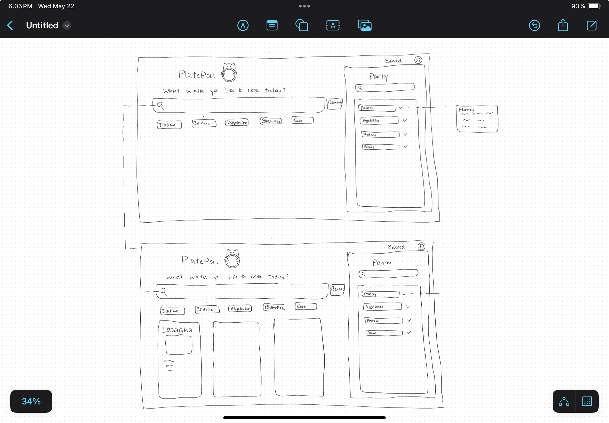
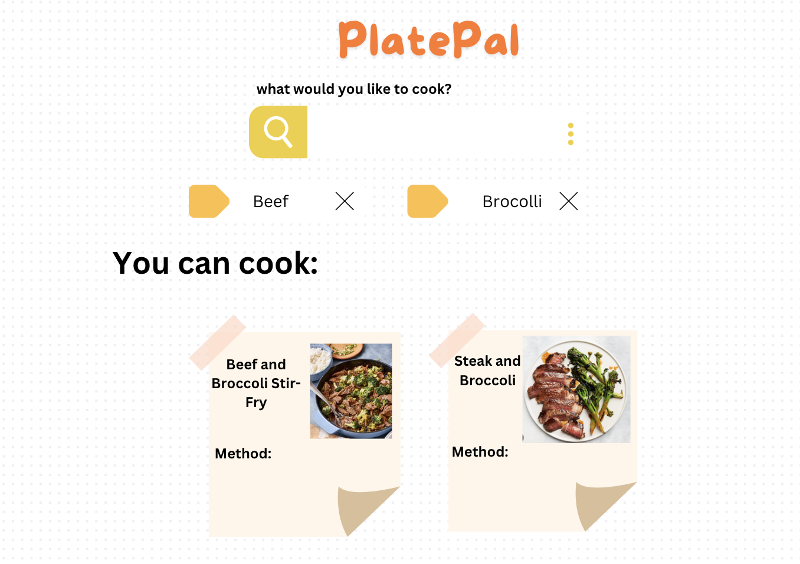
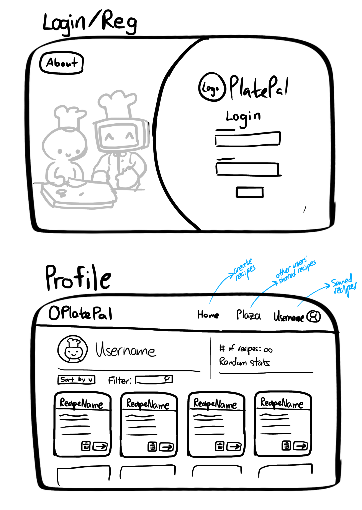

# Group Moai🗿 - PlatePal

## Project Description

Discover easy cooking with PlatePal, an all-in-one recipe app for aspiring home chefs, foodies, and anyone who wants to cook but only has 5 ingredients in their fridge at a time. Simply input your ingredients and let AI do the rest by generating personalized, allergy-friendly recipes. Don’t like a certain recipe? Downvote it. Love a recipe? Save it! Never run out of inspiration again with our community explore page, where you can see your foodie friends’ favourite recipes and share yours too.

## Project Task Requirements

Minimal Requirements
- User login feature with username and password :white_check_mark:
- Inputting the ingredients via search and select :white_check_mark:
- Button to generate recipe :white_check_mark:
- Viewing the actual recipe instructions :white_check_mark:

Standard Requirements
- Have the AI generate the recipe based on the inputted ingredients :white_check_mark:
- Favouriting recipes and viewing the saved recipes :white_check_mark:
- Modifying saved recipes such as editing the ingredient list or changing an instruction :white_check_mark:
- Sorting for user recipes and filtering functionality for generated recipes :white_check_mark:
- Upvoting/downvoting a recipe? :white_check_mark:
- Regular image upload for recipe (if AI doesn’t work out) :white_check_mark:

Stretch Requirements
- (AI-generated) images of what the dish looks like (instead used image API that is NOT ai generated)
- Create a “Pinterest”-like dashboard for sharing among users :white_check_mark:
- Users are able to add allergies when generating the recipe :white_check_mark:
- More customization options for users (veggie option/ lactose free option) :white_check_mark:

## Our project and Course content 

### Unit1 CSS and HTML
PlatePal uses HTML for the foundational structure and some common components of the frontend development. CSS is used to style the visual elements to ensure an attractive and user-friendly interface. We utilized CSS techniques to add animation that provide a more visually interactive experience. We also use CSS Modules for many of our components and pages to avoid styling naming conflicts.

### Unit2 React and Redux
We used React for building the dynamic user interface and creating component based architecture which is reusable and efficient for the frontend. React also performs well due to a virtual DOM being rendered instead of a real DOM. We also integrated Redux for managing the state of the data that we get from the database which helped us to reduce repetitive API calls through the application. This combination provides a more flexible and scalable solution compared to other technologies like Angular with NgRx, offering a more modular approach that caters to a wider range of development. 

### Unit3 NodeJS and Express
Our backend infrastructure is built with NodeJS along with Express, a backend framework, to easily manage routes and servers. Our backend structure is comprised of routes, models (our database schemas), controllers, middleware (what runs between getting a request and sending a response), and the Node server itself. Aside from Express, we utilize middleware such as Multer to handle image/file upload. 

### Unit4 MongoDB
MongoDB is employed as our database solution because of its flexibility and scalability than other relational databases such as MySQL. As a NoSQL database, it provides us rapid iteration time when handling the semi-structured data which fits our needs for this project.
We use Mongoose, an object document mapping library, to make it easier to connect to and communicate with our database. Mongoose achieves this by wrapping the standard MongoDB API.

### Unit5 Release Engineering
- We used GitHub actions to automatically deploy any commit or merge to our main branch to our render deployment. We also created a Discord webhook so that our group chat gets notified whenever a build has been successfully deployed.

## Above and beyond

- We created an ad hoc gmail account platepalservice@gmail.com that sends password reset emails. If you forget your password, you can click "forgot password" and it'll send you a temporary password that can be used once and expires in one hour. We chose not to demo this because throwaway email services tend to be finicky and none of us wants to screenshare our personal inboxes. Ran into issues where gmail's authentication for nodemaile is different for regular user login.
- We used socket.io to have a live, real-time updating Explore page. If you like, share, or unshare/delete a recipe, all users looking at the Explore page will instantly see the update. Inspired by Pinterest, the goal for the Explore page was for users to find a community of foodies on our platform, and use Platepal for the social aspect of sharing and collaboration. This was annoying to get right. First of all, for a synchronized and smooth user experience, I opted to use a strategy called optimistic updating, where the frontend will update with the expected data before the backend confirms whether or not it's correct. Normal API calls get like the full recipe or the full recipe as a response, but I can't do that with socket.io because that would cause performance issues, meaning it has to send a "this item's like count increased/decreased" or "this item was added/deleted", and I had to implement proper frontend logic to implement. This took a lot of tweaking to ensure that the data across all clients is correct, especially since the like count is based off previous like count instead of pulling a hard number from the database. I also had to ensure the animations were smooth and keyframed correctly relevant to when it was updated. Finally, when deploying to render, the socket.io stopped working and I had to readjust the parameters to ensure it would pass render's firewall.

## Next Steps
- Dive deeper into the explore page by adding commenting and bookmarking features.
- Let users add a description to their recipes
- Add moderation to ensure recipes being shared are safe and do not contain dangerous ingredients such as inappropriate substances.
- Add search functionality to user profile recipes. Add user profile picture feature.
- If we have money, a better image API :))))))))))))))))))))
- Sorting the items in the Explore page in a meaningful way.

## Team Members Contributions
- Brian: Wrote the sign in/login page and all the backend for it. Account creation, login verification, password reset, etc. Also did the live Explore page for live upvote and new recipe creation using socket.io. Finally, made the CI/CD Discord notification bot.
- Tammie: AI generation feature from end-to-end, including allergies/disliked recipes features, and food preferences feature (vegan, spicy, etc.). Implemented redux, many of the recipe API endpoints, saving AI generated recipes to a user. UI revamps, some UI art, and many integration bugs.
- Abby: Wrote many frontend components for the generating recipe search bar, recipe details and recipe snippet with styling and animation. Implemented End to End social explore feature that allows users to share their recipe or keep it private. Implementing editing recipes and allow users to enter their default seasonings functionalities.
- Elena: Created the main landing page and integrated the sign-in/login component with the landing page. Implemented UI changes and routing behavior logic to nav bar. Dummy user and other integration bug fixes. Overall, I took a more product manager approach focusing on product validation and user experience.

## Task Breakdown
User login feature with username and password
- Frontend form for the users to fill in login/registration info
- Backend API to create new user
- Implement JWT for end-to-end user login/registration

Viewing the actual recipe instructions
- Create recipe schema in backend
- Backend API to fetch the generated recipe
- Having a UI page to display the recipe and load the recipe content
- Create frontend recipe component that parses recipe info from backend to user-friendly format

## Team Members

- Brian Chu: Software Development Intern
- Elena Guo: 4th year BUCS student and aspiring product manager 
- Tammie Liang: 3rd year CS student, currently in a work term
- Abby Hong: 4th year CS+STATS student, currently in a SDE intern

## Prototypes

<!-- ## Images -->

## References

